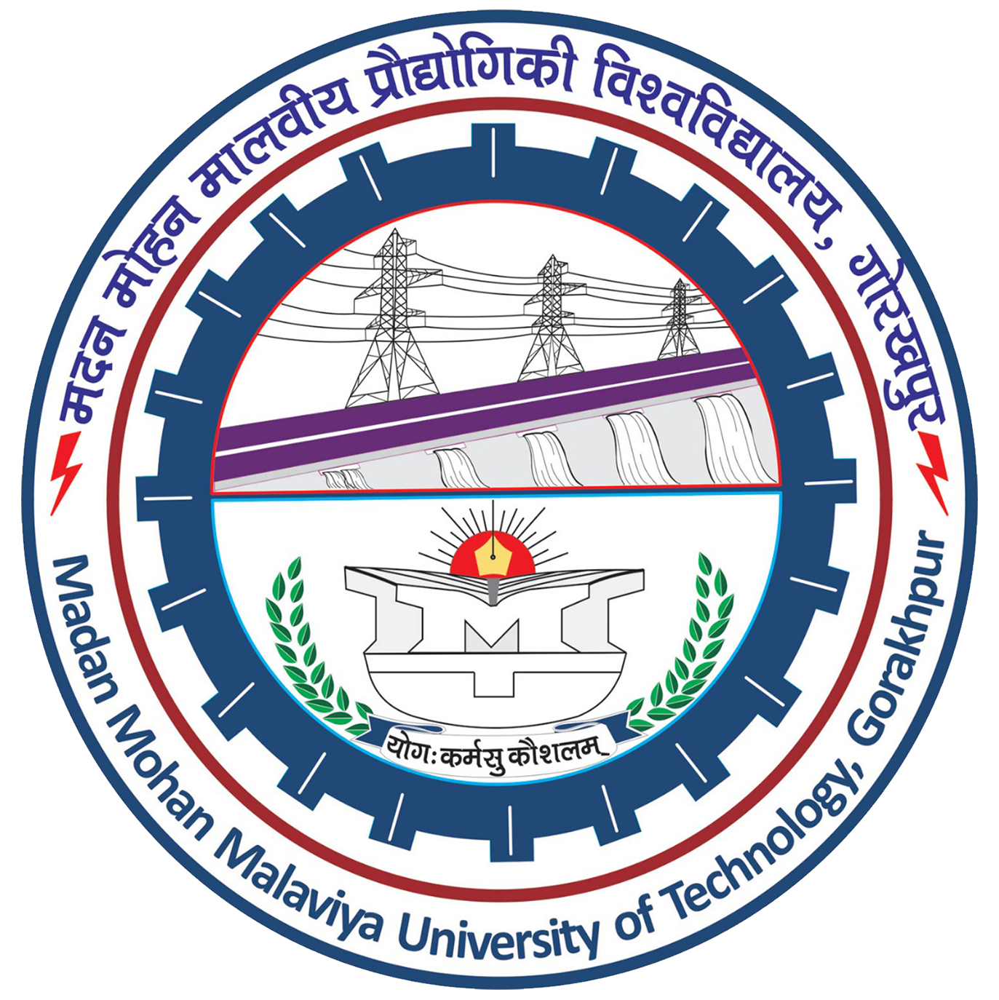
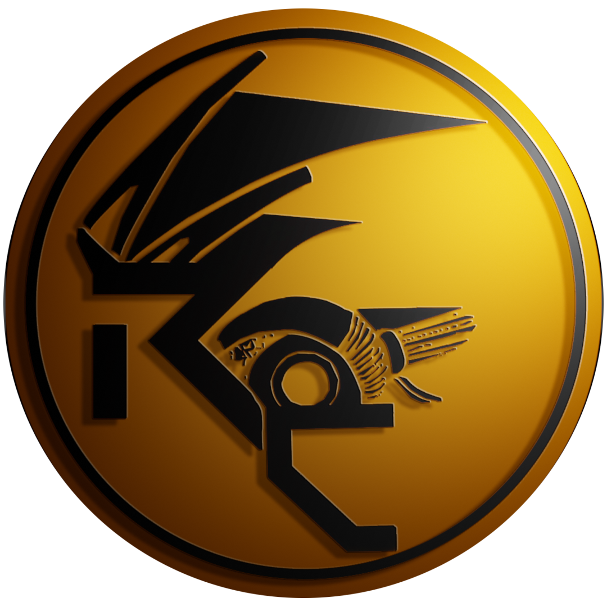

# Web-Quest Final Round 
The boilerplate for the single page website for Robotics Club, MMMUT.

> Seek the content from the official [website][website] of Robotics Club to develop your webpage. The webpage should consists of three sections namely:-
1. Header
      - College Logo
      - RC Logo
      - Name 
2. Body 
      -  Navigation Bar
      -  Headings
      -  Sub-Headings
      -    
3. Footer
      - Short description about self with your image.

---

 

This repository contains:
-  MMMUT logo 
-  RC logo 

---

## Rules
1. Use any front-end language of your choice.
2. The webpage should contain all the things mentioned above.
3. You are free to use more features apart from the mandatory features mentioned above.
4. No copying of code or website is allowed.
5. **Judging Criteria:** Content, Design, Clean code, Responsiveness, Features exhibited.
6. ___Deadline___: 7th August till 10 P.M.

[website]: http://www.roboticsclub.mmmut.ac.in/